# Visual Architecture Map

Repository root: `/Users/thuda/Desktop/Resources/Personal/Projects/AI-Magnet`

```mermaid
flowchart TB
    Visitor["Website visitor"] --> Widget["Static chat widget<br/>widget/chat-widget.js"]
    BusinessUser["Business user"] --> Portal["Business portal<br/>frontend/app/portal"]
    AdminUser["Super admin"] --> AdminPortal["Admin portal<br/>frontend/app/admin"]

    Widget --> Nginx["Nginx reverse proxy<br/>infra/nginx/default.conf"]
    Portal --> Nginx
    AdminPortal --> Nginx

    Nginx --> Backend["FastAPI backend<br/>backend/app/main.py"]

    Backend --> WidgetAPI["/widget/init<br/>backend/app/api/widget.py"]
    Backend --> ChatAPI["/chat/*<br/>backend/app/api/chat.py"]
    Backend --> BusinessAPI["/business-portal/*<br/>backend/app/api/business_portal.py"]
    Backend --> AdminAPI["/admin/*<br/>backend/app/api/admin.py"]
    Backend --> HealthAPI["/health<br/>backend/app/api/health.py"]

    ChatAPI --> ChatService["Chat service<br/>backend/app/chat/service.py"]
    ChatService --> RAGRetrieval["Tenant-scoped retrieval<br/>backend/app/rag/retrieval.py"]
    ChatService --> LeadCapture["Lead capture<br/>backend/app/chat/lead_capture.py"]
    ChatService --> NotificationService["Notification service<br/>backend/app/notifications/service.py"]
    ChatService --> UsageService["Usage logging<br/>backend/app/usage/service.py"]

    BusinessAPI --> RAGIngestion["RAG ingestion<br/>backend/app/rag/ingestion.py"]
    BusinessAPI --> WidgetService["Widget service<br/>backend/app/widget/service.py"]
    BusinessAPI --> Analytics["Tenant analytics<br/>backend/app/analytics/service.py"]

    AdminAPI --> AdminService["Admin service<br/>backend/app/admin/service.py"]
    AdminAPI --> AuditService["Audit service<br/>backend/app/audit/service.py"]
    AdminAPI --> PlatformAnalytics["Platform analytics<br/>backend/app/analytics/service.py"]

    RAGIngestion --> AIProviders["AI provider abstraction<br/>backend/app/providers/ai"]
    RAGRetrieval --> AIProviders
    ChatService --> AIProviders
    NotificationService --> EmailProviders["Email provider abstraction<br/>backend/app/providers/email"]

    Backend --> Postgres["PostgreSQL + pgvector<br/>docker-compose.yml"]
    RAGIngestion --> Postgres
    RAGRetrieval --> Postgres
    ChatService --> Postgres
    BusinessAPI --> Postgres
    AdminAPI --> Postgres
    NotificationService --> Postgres
    UsageService --> Postgres

    Backend -. configured but mostly unused .-> Redis["Redis<br/>docker-compose.yml"]
    Worker["Worker placeholder<br/>backend/app/workers/runner.py"] -. sleeps, no queue processing .-> Redis
    Worker -. shares DB .-> Postgres

    CI["GitHub Actions CI<br/>.github/workflows/ci.yml"] --> Backend
    CI --> Portal
    CI --> DockerCompose["Docker Compose config<br/>docker-compose.yml"]
```

## Notes

- The current architecture is a single-host Docker Compose MVP, not a horizontally scalable production deployment.
- Redis exists as an architectural dependency but is not used for actual background jobs.
- RAG storage is pgvector-ready, but query-time retrieval currently scores tenant chunks in Python.
- Nginx is a basic HTTP reverse proxy and not a complete public production edge.

