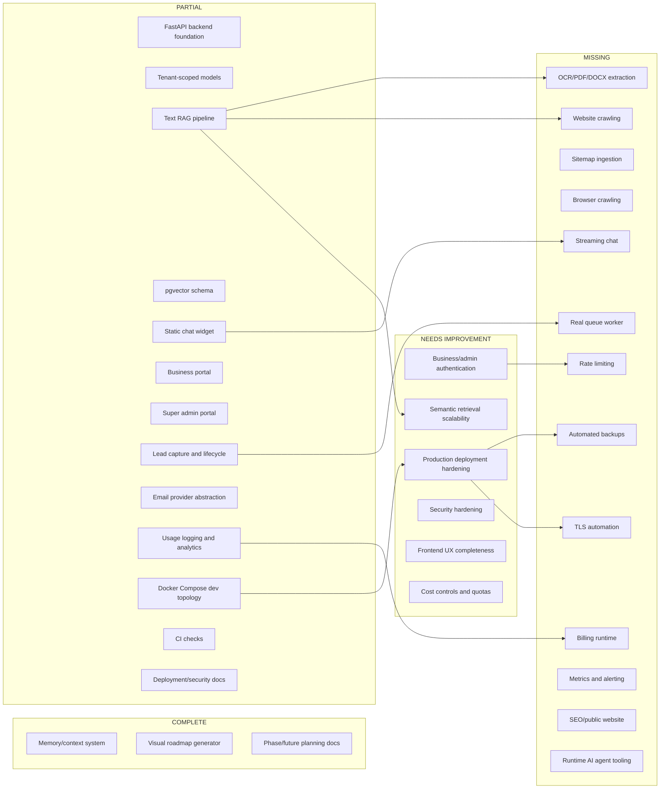
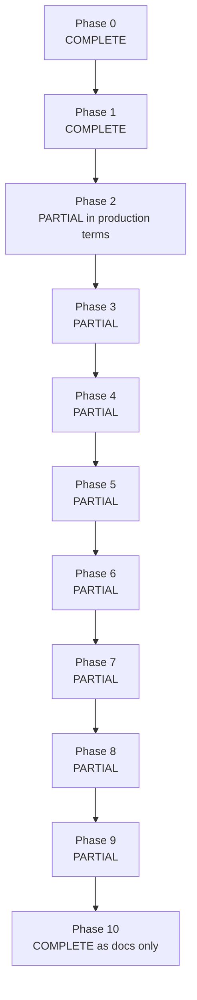

# Visual Implementation Status Map

Repository root: `/Users/thuda/Desktop/Resources/Personal/Projects/AI-Magnet`

Legend:

- COMPLETE: verified implementation is sufficient for planned scope.
- PARTIAL: implementation exists but does not satisfy production or full planned behavior.
- MISSING: no implementation found.
- NEEDS IMPROVEMENT: implemented but architecturally unsafe or weak.

## Phase Status Snapshot

