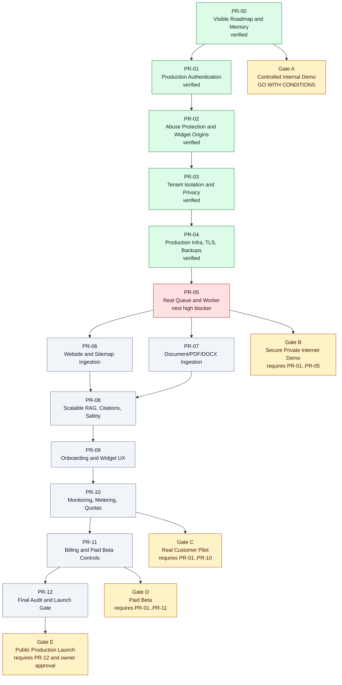

# Phase Dependency Graph

Last updated: 2026-05-28

## Why Gates Block Public Onboarding

PR-01 through PR-05 cover the minimum security and infrastructure requirements before any private internet demo with real risk exposure: production auth, abuse controls, tenant/privacy integrity, TLS/private networking/backups/secrets/scans, and a real worker. Public onboarding is blocked until these controls are verified because the current MVP can otherwise expose accounts, customer data, provider cost, and operational reliability to preventable failure modes.

Real customer pilots require PR-06 through PR-10 because the product workflow depends on safe ingestion, source-grounded RAG, customer setup UX, and operator visibility. Paid beta additionally requires PR-11. Public production launch requires PR-12 and explicit owner approval.
