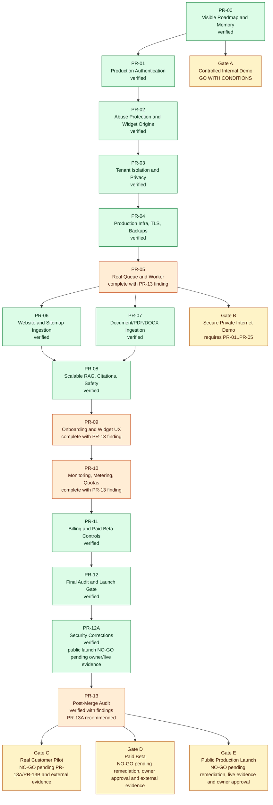

# Phase Dependency Graph

Last updated: 2026-05-30

## Why Gates Block Public Onboarding

PR-01 through PR-05 cover the minimum repository-controlled security and infrastructure requirements before any private internet demo with real risk exposure: production auth, abuse controls, tenant/privacy integrity, TLS/private networking/backups/secrets/scans, and a real worker. PR-06 and PR-07 add safe ingestion paths, PR-08 adds grounded scalable retrieval, PR-09 adds customer setup UX, PR-10 adds operational visibility and quotas, and PR-11 adds manual paid-beta entitlements.

PR-12 is verified as a repository-controlled launch-gate package. PR-12A adds independent-review security corrections for mandatory production super-admin MFA and Redis-backed application rate limiting. PR-13 adds the post-merge audit and reopens specific high findings for worker concurrency-safe job claiming, persisted rate-limit abuse analytics, and reproducible browser/e2e evidence. Gate E remains NO-GO because public production requires repository remediation where applicable plus owner-approved live evidence for TLS, firewall, backup/restore, worker/Redis, PostgreSQL/pgvector RAG, controlled crawl/document smoke, alerting, quota/abuse smoke, and explicit owner approval.
